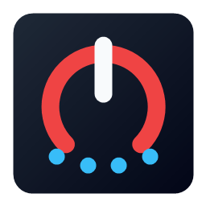

<p align="center"></p>
<h1 align="center">AppCircuit</h1>
<p align="center">Запускайте программы и открывайте файлы в нужном порядке одной сессией.</p>
<p align="center"><a href="README.en.md">English</a> · <a href="https://github.com/Frommer-droid/AppCircuit/releases/latest">Последняя версия</a></p>

AppCircuit — приложение для Windows 10/11, в котором можно собрать последовательность
действий из запуска и остановки программ, открытия файлов и пауз. Включённые шаги
выполняются по порядку. Сессии сохраняются локально.

## Установка и первый запуск

1. Скачайте установщик со страницы [последней версии](https://github.com/Frommer-droid/AppCircuit/releases/latest) и установите AppCircuit.
2. Создайте сессию кнопкой «Новая» и добавьте в неё нужные программы или файлы.
3. Выберите действие для каждого шага, при необходимости добавьте паузы и нажмите «Применить сессию».

Для запуска `.exe` можно выбрать «Запустить» или «Остановить». Другие файлы
открываются приложением, назначенным в Windows. Уже запущенная программа с тем же
полным путём повторно не запускается; остановка адресуется этой копии и её
дочерним процессам. Для остановки программы с повышенными правами AppCircuit
тоже могут потребоваться права администратора.

## Сессии и отдельный EXE

- Галочки слева от названий сессий определяют, какие из них попадут в JSON-экспорт.
- Импорт добавляет новые сессии и заменяет только сессии с совпадающим именем.
- Кнопка «Создать EXE» берёт подсвеченную сессию, независимо от галочки экспорта.
  Полученный файл выполняет снимок её включённых шагов без окна AppCircuit и без
  установленного Python. После изменения сессии создайте EXE заново.

Пути внутри сессий абсолютные: программы и документы должны оставаться на своих
местах. Пользовательские `settings.json` и журнал находятся рядом с AppCircuit.exe
и не входят в установщик.

## Запуск из исходников

Нужны Windows 10/11 и Python 3.12. В корне проекта:

```powershell
py -3.12 -m venv .venv
.\.venv\Scripts\python.exe -m pip install -e ".[dev]"
.\.venv\Scripts\pythonw.exe .\AppCircuit.py
```

Проверки: `.\.venv\Scripts\python.exe -m pytest` и
`.\.venv\Scripts\python.exe -m ruff check .`. Сборка описана в
[DEVELOPER.md](DEVELOPER.md), изменения версий — в
[RELEASE_NOTES.md](RELEASE_NOTES.md).

## Ограничения и лицензия

Для шагов запуска программ не задаются индивидуальные аргументы командной строки.
Автономный EXE хранит снимок сессии; пути к её файлам не упаковываются внутрь.

Собственный код AppCircuit распространяется по [MIT](LICENSE). Условия сторонних
компонентов приведены в [THIRD_PARTY_NOTICES.md](THIRD_PARTY_NOTICES.md) и
[QT_PYSIDE6_COMPLIANCE.md](QT_PYSIDE6_COMPLIANCE.md).
